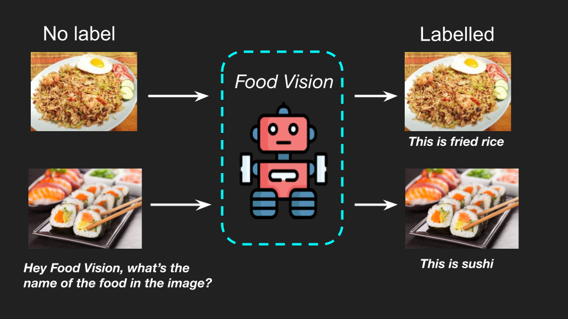

<h1 align="center">Food Vision🍔📷</h1>
<h3 align="center">Upload a photo of food and Food Vision will tell you what it is.</h3>


<div align="center" id="top">
  
  <a href="https://huggingface.co/spaces/sirfindcent/food-vision">Demo</a>

  <a href="https://github.com/sirfindcent/food-vision/stargazers" target="_blank">
    
  </a>
  
</div>

## 🎯 About ##
This app uses computer vision to identify the name of the food in a photo. Simply upload a photo of your food, and the app will tell you what it is.

Whether you're curious about a new dish, looking for nutritional information, or trying to avoid allergens, this app is the perfect tool for you. It's also great for people with dietary restrictions, as it can help you identify foods that are safe for you to eat.

This project is inspired by the 2016 paper [Food101 paper](https://data.vision.ee.ethz.ch/cvl/datasets_extra/food-101/).




## 🤖 Models Experiments 
To build the app, I've tried several models. The following table shows some of the best-performing models for every notebook. All the notebooks are available [here](https://github.com/sirfindcent/food-vision/tree/main/Notebooks).


| Deep Learning Model | Data | Validation Accuracy |
|---|---|---|
| [Feature Extracted Efficientnetb0](https://github.com/sirfindcent/food-vision/blob/main/Notebooks/01_food_vision_feature_extraction.ipynb)| 10% of Food101 Dataset with 10 classes | 86% |
| [Fine-tuned Efficientnetb0](https://github.com/sirfindcent/food-vision/blob/main/Notebooks/02_food_vision_fine_tune.ipynb) | 100% of Food101 Dataset with 10 classes | 91% |
| [Fine-Tuned Efficientnetb0](https://github.com/sirfindcent/food-vision/blob/main/Notebooks/03_food_vision_mini.ipynb) | 10% of Food101 Dataset with 101 classes | 57% |
| [Fine-Tuned Efficientnetb0](https://github.com/sirfindcent/food-vision/blob/main/Notebooks/04_food_vision.ipynb) | 100% of Food101 Dataset with 101 classes | 80% |


The models are trained on [Food101 Dataset](https://www.tensorflow.org/datasets/catalog/food101) provided by Tensorflow.

## 🖥️ Steps to run the app locally
If this doesn't work please [leave an issue](https://github.com/sirfindcent/food-vision/issues).

### Clone the repo
```
git clone https://github.com/sirfindcent/food-vision.git
cd food-vision
```

### Create the environment
I use `venv` for my environment and PowerShell for the command. You could do similar with Conda and pip, but I prefer `venv`.

```
python -m venv myvenv
myvenv/Scripts/activate.ps1
pip install -r requirements.txt
```


### Run the app
```
streamlit run app.py
```


## ☎️ Contact Me
<p align="start">
    <a href="https://www.linkedin.com/in/sirfindcent" target="_blank">
        
    </a>
    <!-- <a href="https://twitter.com/sirfindcent" target="_blank">
        
    </a> -->
    <a href="https://github.com/sirfindcent" target="_blank">
        &nbsp;
    </a>
</p>

<a href="#top">Back to top</a>